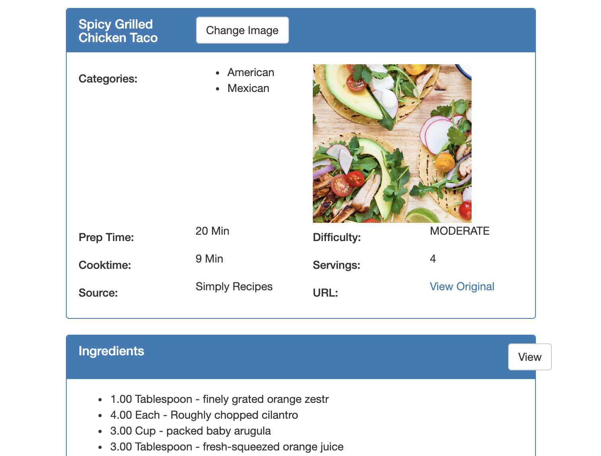
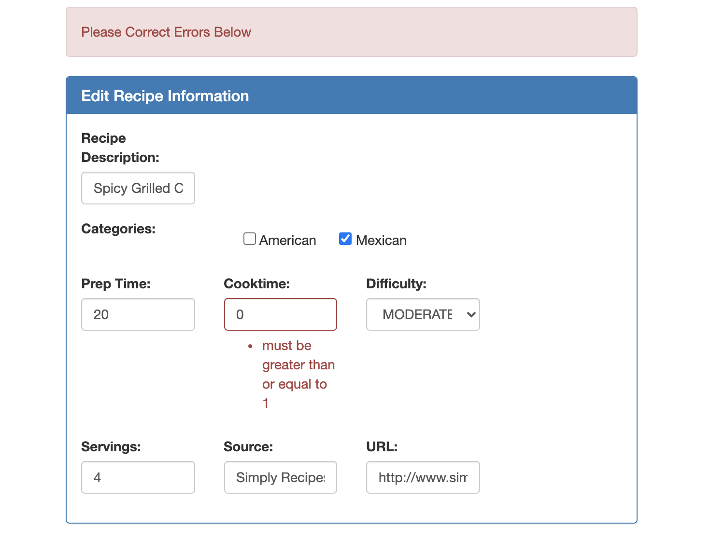

# Spring Boot Recipe Application

A recipe list web application using Spring Framework

## Dependencies
| name | version |
| :---: | :---: |
| Spring Web | 2.1.0 |
| Spring Data JPA | 2.1.0|
| Thymeleaf | 2.1.0|
| H2 Database | 1.4.197 |
| Lombok | 1.18.20 |

## Components
    PATH = src/main/java/.../
| component name | description |
| :---: | :---: |
| domain | basic model classes for service |
| repositories | repositories extends from CrudRepository (org.springframework.data.repository) |
| services | backend service functions |
| controllers | page controllers for URL routing and call service functions for backend operations |
| exceptions | handle exceptions for HTTP request |
| commands | asynchronous commands for thread safety when operating the database |
| converters | convert command classes to model ojects under domain |

## Preview
#### Recipe Page

#### Input invalid when updating

JAVA Project For online study.
